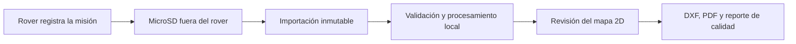

# RoverRender2D

RoverRender2D es una aplicación de escritorio para Windows que convertirá misiones registradas por un rover agrícola en una base planimétrica 2D trazable y editable. El caso de uso inicial es Finca Ramírez, León, Nicaragua, para cultivo de naranja dulce.

El flujo es deliberadamente **offline**: la Raspberry Pi registra la misión en una microSD, la aplicación copia y valida el paquete sin modificar la fuente, procesa los datos localmente y permite revisar el resultado antes de exportarlo. No hay telemetría en vivo, control remoto ni servicios de nube.



## Estado

El proyecto está en bootstrap técnico. El contrato v1 incluido es un contrato sintético/de referencia; todavía no demuestra compatibilidad con un LiDAR, GPS, IMU, encoder o cámara físico. Consulta el [backlog](docs/backlog.md), las [limitaciones](docs/limitations.md) y la [lista de integración de sensores](docs/sensor-integration-checklist.md).

## Alcance del MVP

- Detectar una unidad extraíble o seleccionar una carpeta e importar una misión sin alterar el origen.
- Validar manifiesto, rutas, tamaños, versiones, checksums y coherencia temporal.
- Leer e indexar el log binario por streaming, con cancelación, reanudación y recuperación acotada ante registros dañados.
- Informar la calidad de sensores y reconstruir una trayectoria 2D con incertidumbre explícita.
- Crear capas de trayectoria, nube 2D, candidatos a árboles, obstáculos, límites y puntos de control.
- Permitir pan, zoom, medición, selección, edición no destructiva y Replay diferido.
- Guardar el proyecto derivado y exportar DXF editable, PDF vectorial y un reporte trazable.

Quedan fuera del MVP el control del rover, la telemetría en vivo, ROS, la reconstrucción 3D, el diseño hidráulico automático, DWG nativo y cualquier certificación topográfica, catastral o hidráulica.

## Requisitos de desarrollo

- Windows x64.
- SDK estable de .NET 10.
- Visual Studio con la carga de trabajo de escritorio de .NET, o una terminal con el SDK para compilar y probar.

El diagnóstico de la estación de trabajo está en [docs/environment.md](docs/environment.md).

## Compilar y probar

Desde la raíz del repositorio:

```powershell
dotnet restore
dotnet build -c Release
dotnet test -c Release
```

Para iniciar la aplicación durante el desarrollo:

```powershell
dotnet run --project src/RoverRender2D.Desktop/RoverRender2D.Desktop.csproj
```

Los comandos reflejan la estructura objetivo. Durante el bootstrap, consulta el backlog si algún proyecto aún no forma parte de la solución.

## Arquitectura

La solución es un monolito modular con dependencias dirigidas hacia el dominio. El código de dominio no depende de WinForms, almacenamiento, Protobuf, renderizadores ni bibliotecas CAD.

```text
src/        producto por módulos
tests/      pruebas unitarias, de integración y arquitectura
tools/      generador determinista de misiones sintéticas
benchmarks/ mediciones reproducibles
samples/    muestras sintéticas, nunca presentadas como capturas reales
docs/       especificaciones, decisiones y guías
```

Lee [la arquitectura](docs/architecture.md), [el contrato de datos](docs/data-contract.md), [los sistemas de coordenadas](docs/coordinate-systems.md) y [el pipeline](docs/processing-pipeline.md) antes de cambiar límites entre módulos.

## Integridad y privacidad

Una microSD se trata como entrada no confiable. RoverRender2D no ejecuta archivos de una misión, no escribe en el medio de origen y rechaza rutas que escapen del paquete. Las coordenadas y los datos crudos permanecen locales; no se envía telemetría de uso.

Las muestras compartidas deben estar autorizadas y, cuando corresponda, anonimizadas. Los datos sintéticos se identifican de forma explícita.

## Contribuir

Consulta [CONTRIBUTING.md](CONTRIBUTING.md) y [AGENTS.md](AGENTS.md). Cada incremento debe ser pequeño, compilable, probado y documentado. No se ha agregado una licencia: la elección sigue pendiente del propietario.

Propietario académico: **Kevin Alexander Ramírez Blanco**.
