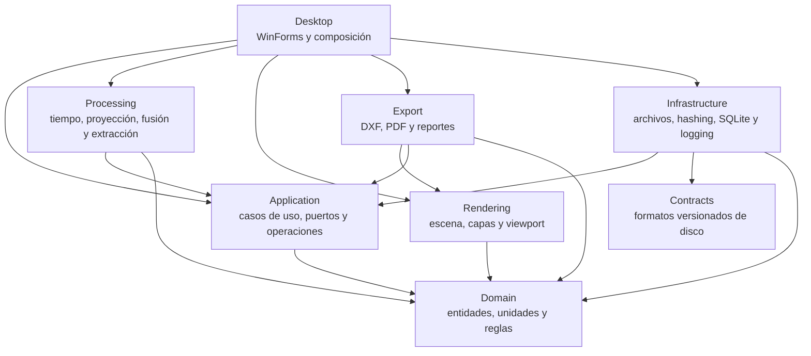
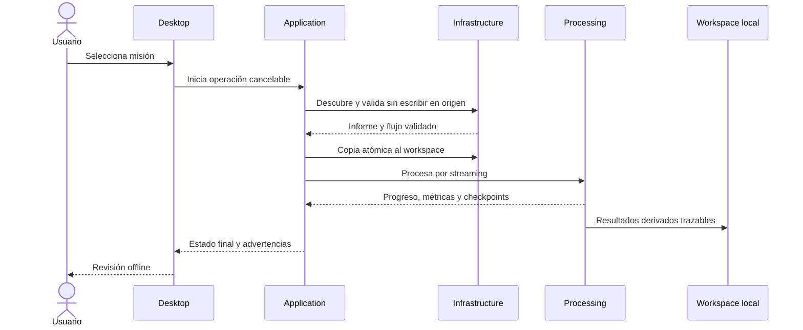

# Arquitectura

## Contexto

RoverRender2D procesa offline paquetes potencialmente grandes y no confiables, genera resultados espaciales trazables y mantiene una UI de escritorio receptiva. El diseño es un **monolito modular**: una sola aplicación desplegable, límites internos explícitos y dependencias dirigidas hacia el dominio.

Decisión base: [ADR-0001](adr/0001-modular-monolith.md). Decisión de UI: [ADR-0002](adr/0002-winforms-desktop-ui.md).

## Módulos y dependencias



Las flechas representan referencias permitidas, no obligación de que exista cada una. Las pruebas de arquitectura deben impedir referencias circulares y dependencias de `Domain` hacia módulos exteriores.

| Proyecto | Responsabilidad | No debe contener |
|---|---|---|
| `RoverRender2D.Domain` | Identidades, unidades, geometría, observaciones validadas, poses, resultados y reglas puras | IO, WinForms, SQLite, Protobuf, logging concreto |
| `RoverRender2D.Application` | Casos de uso, puertos, progreso, cancelación, estados y coordinación | Detalles de archivos, controles UI o algoritmos pesados |
| `RoverRender2D.Contracts` | DTO y esquemas versionados de `mission.json`, `.rvrlog` y payloads | Confianza implícita en la entrada o reglas del dominio |
| `RoverRender2D.Infrastructure` | Descubrimiento/copia, rutas seguras, hashes, índices, workspace, configuración y logs | Reglas agronómicas o de presentación |
| `RoverRender2D.Processing` | Calidad, tiempo, proyección, LiDAR, estimación, pose graph, nube y extracción | Controles WinForms o acceso directo no abstraído al medio |
| `RoverRender2D.Rendering` | Modelo de escena, transformaciones mundo-pantalla, estilos, selección, culling y LOD | Casos de uso de importación o persistencia concreta |
| `RoverRender2D.Export` | Modelos y escritores DXF/PDF/reportes, validación y preview | Mutación de observaciones o decisiones de UI |
| `RoverRender2D.Desktop` | Composición, ventanas, controles y experiencia en español | Algoritmos de procesamiento o parsing binario |

`RoverRender2D.MissionGenerator` es una herramienta, no una fuente de datos medidos. Produce misiones deterministas y claramente sintéticas.

## Flujo de una operación



Las operaciones largas exponen progreso estructurado y aceptan `CancellationToken`. El hilo de UI solo presenta estado. Los canales acotados crean backpressure entre productores y consumidores; la misión completa nunca se materializa en una lista.

## Modelo de datos y confianza

Existen tres fronteras distintas:

1. **Entrada no confiable:** bytes, JSON y rutas desde microSD/carpeta.
2. **Contrato validado:** estructuras versionadas que pasaron límites, CRC/hash y coherencia básica.
3. **Dominio:** observaciones con unidades, tiempo, CRS, calidad y semántica explícitos.

La conversión entre fronteras es deliberada y puede producir varios `ValidationIssue`; deserializar un DTO no lo convierte en evidencia válida. Los datos se etiquetan como medidos, estimados, sintéticos o editados.

## Datos en ejecución

La ubicación prevista es:

```text
%LocalAppData%/RoverRender2D/
├── Missions/<mission-id>/source/   copia inmutable validada
├── Missions/<mission-id>/workspace.db
├── Missions/<mission-id>/cache/
├── Missions/<mission-id>/exports/
└── Logs/
```

El log de origen conserva payloads masivos. SQLite guarda índices, parámetros, checkpoints, resultados compactos y revisiones; las cachés regenerables se separan. Consulta [ADR-0005](adr/0005-derived-workspace-storage.md).

## Extensibilidad

- Un adaptador físico traduce un protocolo documentado al contrato canónico; nunca se agrega lógica específica del sensor al dominio.
- IMU, encoders y marcadores visuales son fuentes opcionales. La ausencia se expresa en capacidades y calidad, no con valores ficticios.
- Proyección, scan matching, estimador, almacenamiento, renderizado y exportación se conectan mediante puertos estrechos y configuraciones versionadas.
- El futuro módulo de riego consumirá una base planimétrica revisada; no forma parte del núcleo de reconstrucción.

## Verificación arquitectónica

- Pruebas automáticas de referencias permitidas y ausencia de ciclos.
- Pruebas de contratos y adaptadores sin iniciar WinForms.
- Pruebas de presenters/view models sin controles reales.
- Pruebas de integración con archivos temporales y misiones sintéticas deterministas.
- Benchmarks de streaming, memoria y renderizado con misiones de 10, 30 y 60 minutos.

Un cambio que altere límites, dirección de dependencias o responsabilidad de módulos requiere actualizar este documento y registrar un ADR.
