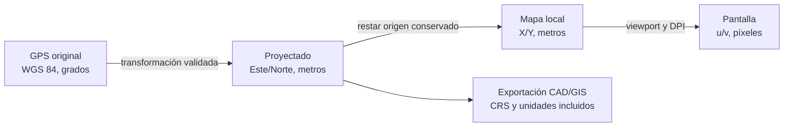

# Sistemas de coordenadas y convenciones

Decisión normativa: [ADR-0004](adr/0004-coordinate-reference-systems.md).

## Espacios usados

| Espacio | Representación | Unidades | Uso |
|---|---|---|---|
| Geográfico | Latitud/longitud WGS 84 | Grados en la frontera de IO | Conservar observación GPS original |
| Proyectado | Este (`E`), Norte (`N`) y CRS explícito | Metros | Distancias, fusión, geometría y CAD |
| Local de mapa | `X = Este`, `Y = Norte`, origen proyectado conservado | Metros | Cálculo numérico y render estable |
| Cuerpo del rover | `X` hacia delante, `Y` hacia la izquierda | Metros | Scans, extrínsecos y movimiento relativo |
| Pantalla | `u` a la derecha, `v` hacia abajo | Píxeles lógicos/físicos | Solo presentación |

No se mezclan coordenadas que carezcan de CRS u origen. Los tipos de dominio deben impedir intercambiar accidentalmente `GeoCoordinate`, `ProjectedCoordinate` y `LocalCoordinate`.



## Orientación y ángulos

- En mundo y mapa local: `X` apunta al Este y `Y` al Norte.
- `yaw = 0` apunta al Este.
- El yaw positivo gira en sentido antihorario, de Este hacia Norte.
- El núcleo usa radianes y normaliza ángulos a `[-π, π)`.
- Grados se admiten solo en contratos/UI que los declaren; se convierten una vez en la frontera.
- Una orientación desconocida no se reemplaza por cero sin una bandera de validez.

Para una pose `(E, N, θ)` y un punto LiDAR ya corregido a cuerpo `(x_b, y_b)`:

```text
E_point = E + cos(θ) * x_b - sin(θ) * y_b
N_point = N + sin(θ) * x_b + cos(θ) * y_b
```

Los extrínsecos sensor→cuerpo se aplican antes de cuerpo→mundo y deben incluir procedencia, fecha y versión de calibración.

## Selección del CRS

Las observaciones GPS se conservan siempre en WGS 84 (`EPSG:4326`). Para Finca Ramírez, **UTM zona 16N (`EPSG:32616`) es solo un candidato** por la ubicación general indicada. Antes de adoptarlo para una misión se debe validar:

1. que coordenadas autorizadas de la parcela caen dentro de la zona y hemisferio esperados;
2. que manifiesto, configuración y puntos de control no indican otro CRS;
3. que la librería transforma puntos de prueba conocidos dentro de la tolerancia definida;
4. que el usuario confirma el CRS de exportación cuando existe ambigüedad.

Nunca se infiere un CRS a partir de la apariencia de números. Si falta información, el procesamiento se detiene antes de calcular distancias/exportar o trabaja en un marco local explícitamente no georreferenciado y así lo etiqueta.

## Origen local y precisión

Las coordenadas UTM grandes no se envían directamente a transformaciones de pantalla en precisión reducida. Cada proyecto guarda un origen `(E0, N0)` en doble precisión y calcula:

```text
x_local = E - E0
y_local = N - N0
```

El origen es metadato, no una traslación destructiva: el regreso a proyectado suma exactamente el offset. Cambiar el origen de visualización no cambia la geometría georreferenciada ni las revisiones.

## Tiempo, curso y orientación

El curso GPS no equivale al yaw del chasis cuando el rover está detenido, derrapa o retrocede. Solo se usa con velocidad y calidad suficientes. IMU y LiDAR requieren sincronización temporal y extrínsecos antes de fusionarse. Las covarianzas se transforman con sus jacobianos y conservan unidades.

## Exportación y trazabilidad

Cada DXF, PDF o archivo espacial debe registrar:

- identificador/nombre de CRS, datum, zona y unidades;
- si contiene coordenadas proyectadas completas o un origen local;
- `E0/N0` cuando use origen local;
- transformación y versión de biblioteca/configuración;
- advertencias, puntos de control y revisiones aplicadas.

Un DXF sin metadatos embebibles debe acompañarse de notas y reporte. Nunca se recorta o traslada silenciosamente.

## Pruebas mínimas

- Puntos publicados de referencia WGS 84↔CRS proyectado, con tolerancia explícita.
- Round trip geográfico→proyectado→geográfico.
- Cuadrantes y límites de normalización angular.
- Composición e inversión de poses y extrínsecos.
- Idéntico resultado al cambiar solo el origen local.
- Coordenadas bajo cursor y medidas estables a distintos zoom y DPI.
- Rechazo de CRS ausente, hemisferio incorrecto y mezcla metros/grados.
