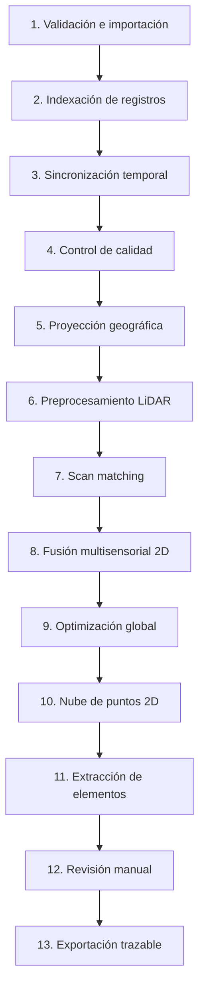

# Pipeline de procesamiento offline

El pipeline convierte una copia local validada en resultados derivados y revisables. Es secuencial en dependencias, pero cada etapa puede trabajar por streaming y con paralelismo acotado. Ninguna etapa modifica la microSD ni la copia inmutable de `source/`.

## Contrato de una etapa

Cada etapa declara:

- ID y versión de algoritmo/configuración;
- hashes de entradas y predecesores requeridos;
- flujo de entrada/salida y presupuesto de memoria;
- unidades, CRS y marco temporal;
- progreso por unidades reales —bytes, registros, scans o chunks—;
- métricas, advertencias y códigos de error;
- puntos seguros de cancelación y estrategia de reanudación;
- checkpoint y hash del resultado derivado.

Para mismas entradas, parámetros y versión, el resultado debe ser determinista. La concurrencia no puede cambiar orden, redondeos o semillas sin registrarlo.

## Etapas y artefactos

| Etapa | Entrada principal | Salida/checkpoint | Validación clave |
|---|---|---|---|
| 1. Validación/importación | Paquete no confiable | Copia inmutable y reporte de integridad | Rutas, límites, espacio, SHA-256, manifiesto y cabecera |
| 2. Indexación | `.rvrlog` validado | Offsets, tipos, secuencias y tiempos en SQLite | CRC, truncamiento, huecos y recuperaciones |
| 3. Tiempo | Índice y anclas | Línea temporal canónica, offsets/relojes | Monotonicidad, drift, saltos y fuentes UTC |
| 4. Calidad | Observaciones indexadas | Métricas por sensor e intervalos | Disponibilidad, frecuencia, validez y saturación |
| 5. Proyección | GPS WGS 84 validado | Observaciones proyectadas y origen local | CRS, unidades, rango, round trip y puntos de control |
| 6. LiDAR | Scans y calibración | Scans filtrados/chunks | Valores finitos, rango, máscara, extrínsecos y retención |
| 7. Scan matching | Scans y submapa | Restricciones relativas con confianza | RMSE, inliers, condición y degeneración |
| 8. Fusión | Restricciones y observaciones | Poses y covarianzas | Gating, calidad GPS, ángulos y pérdida de localización |
| 9. Optimización | Nodos/restricciones | Trayectoria optimizada | Convergencia, residuos, jacobianos y condición |
| 10. Nube global | Scans y trayectoria | Chunks espaciales/LOD | Transformación, densidad, límites y trazabilidad |
| 11. Elementos | Nube, calidad y controles | Candidatos con confianza/origen | Persistencia, falsos positivos y no confundir límite legal |
| 12. Revisión | Resultados derivados | Revisiones no destructivas | Undo/redo, autoría, orden y autosave |
| 13. Exportación | Revisión seleccionada | DXF/PDF/reporte | CRS, escala, capas, no recorte y round trip |

Las etapas 1–2 forman el foco de la Fase 2. Las etapas posteriores son diseño objetivo; no se consideran implementadas por aparecer en este documento.

## Streaming y backpressure

- Los lectores exponen `IAsyncEnumerable<T>` o un puerto equivalente.
- Entre etapas concurrentes se usan `Channel<T>` de capacidad limitada. Un productor espera cuando el consumidor alcanza su presupuesto.
- Buffers grandes pueden usar `ArrayPool<T>`/`MemoryPool<T>`, siempre con devolución garantizada y sin conservar referencias después del lease.
- Scans, puntos y resultados se escriben por chunks; las listas globales sin límite están prohibidas.
- El índice conserva offsets del log para Replay y reprocesamiento selectivo.
- El prefetch se limita por bytes y ventana temporal, no por “todo lo disponible”.

La meta inicial es procesar una misión de una hora en una PC de 8 GB sin crecimiento de memoria proporcional a la duración. Este objetivo debe validarse con benchmarks, no asumirse.

## Cancelación, fallos y reanudación

La cancelación es cooperativa y se comprueba antes/después de IO, por lote de registros, por scan y en iteraciones costosas. El objetivo visible es responder en menos de dos segundos en un punto seguro. Una cancelación:

1. deja de aceptar trabajo nuevo;
2. drena o descarta buffers según la política declarada;
3. completa/cierra transacciones sin publicar artefactos parciales como válidos;
4. persiste el último checkpoint confirmado;
5. informa estado `Cancelled`, no `Failed` ni `Completed`.

Cada checkpoint referencia hashes de entrada, configuración, etapa y versión. Al reabrir, un checkpoint solo se reutiliza si todos coinciden; si no, se invalida esa etapa y sus dependientes. Los archivos se escriben a temporal y se promueven atómicamente.

Errores recuperables —por ejemplo un frame con CRC incorrecto seguido de resincronización válida— degradan calidad y quedan en el reporte. Errores que impiden conocer framing, CRS o procedencia detienen las etapas dependientes. Nunca se reemplazan datos faltantes por valores plausibles sin una marca de estimación.

## Estrategia algorítmica prevista

### LiDAR y odometría

Los filtros son configurables según evidencia del sensor: rango, valores no finitos, compensación angular/extrínseca, mediana moderada, reducción 2D, saltos y máscara de chasis. El dato original se conserva.

El scan matching previsto combina estimación inicial, búsqueda correlativa acotada y refinamiento 2D punto-a-línea contra submapa. Usa correspondencias espaciales, rechazo geométrico y pérdida robusta. Un resultado degenerado se rechaza explícitamente con RMSE, tasa de inliers, condición y confianza.

### Fusión y optimización

El primer estimador será 2D. LiDAR aporta movimiento relativo; GPS una observación absoluta; curso/velocidad GPS solo cuando su calidad sea suficiente; IMU y encoders son opcionales. Covarianza, gating de Mahalanobis, normalización angular y pérdida de localización son obligatorios.

Después, un pose graph offline combina restricciones LiDAR, anclas GPS y loop closures validados. Los jacobianos se comparan numéricamente y las matrices mal condicionadas producen un rechazo diagnosticable.

### Elementos

La trayectoria optimizada transforma scans a una nube global por chunks. La extracción produce **candidatos** de árbol/obstáculo con centro, radio estimado, observaciones y confianza. Un límite geométrico detectado no se etiqueta como límite legal; el origen debe ser geocerca proporcionada, puntos de control o edición del usuario.

## Observabilidad y procedencia

Cada ejecución conserva:

- misión y operación, etapa y versión;
- hashes de archivos, parámetros y calibraciones;
- versión de aplicación y commit cuando esté disponible;
- progreso, duración, contadores y memoria aproximada;
- advertencias, recuperaciones y excepciones contextualizadas;
- revisiones manuales seleccionadas para exportar.

Los logs no incluyen payloads crudos completos. El reporte separa hechos medidos, resultados estimados, datos sintéticos y correcciones manuales.

## Validación end-to-end

Misiones sintéticas de 10, 30 y 60 minutos deben incluir ground truth, filas repetidas, pérdida GPS, oclusiones, puntos móviles, frames corruptos y retiro simulado del medio. Se miden indexación, memoria máxima, tiempo por scan, error de trayectoria, inliers, falsos positivos/negativos, FPS de Replay y exportación. Los umbrales se fijan con evidencia por dataset y no se generalizan a sensores físicos sin ensayos.
