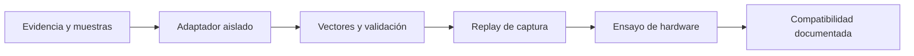

# Lista de integración de sensores

Objetivo: reunir evidencia suficiente para implementar un adaptador físico sin adivinar protocolos, unidades, tiempos ni precisión. Completar esta lista por **modelo + firmware + configuración**; una variante no hereda compatibilidad automáticamente.

Estado inicial de todos los sensores físicos: **no verificado / no compatible todavía**. El contrato de [data-contract.md](data-contract.md) es canónico y sintético; no describe el cable ni protocolo del dispositivo.

## Evidencia común

- [ ] Fabricante, modelo exacto, revisión de hardware y número de serie anonimizado cuando corresponda.
- [ ] Firmware y configuración exportada.
- [ ] Manual oficial del protocolo y licencia/permiso para usarlo.
- [ ] Interfaz física y lógica: USB/UART/Ethernet/I²C/SPI, velocidad, paridad, niveles y framing.
- [ ] Unidades, ejes, signos, rangos, resolución, frecuencia nominal/real y valores de invalidez.
- [ ] Fuente de timestamp, resolución, wraparound, latencia y relación con el reloj monotónico del logger.
- [ ] Posición/orientación en el rover y calibración extrínseca con incertidumbre/procedencia.
- [ ] Captura cruda corta, captura de misión completa y caso de error/truncamiento autorizados.
- [ ] Herramienta o pasos reproducibles para obtener las muestras sin transformarlas.
- [ ] Confirmación de que datos y coordenadas pueden almacenarse en el repositorio o estrategia de anonimización.

## LiDAR 360°

- [ ] Marca/modelo y revisión exactos.
- [ ] Frecuencia de giro, modo(s), resolución angular, alcance mínimo/máximo y precisión declarada.
- [ ] Convención del ángulo cero, sentido de giro, orden de muestras y marco de ejes.
- [ ] Intensidad/calidad disponible, bits inválidos, saturación y política para distancia cero.
- [ ] Formato de paquete, endianness, checksum, secuencia, fragmentación y recuperación ante pérdida.
- [ ] Momento asociado a scan y/o rayos individuales; compensación de movimiento requerida.
- [ ] Máscara del chasis y ubicación/orientación medidas.
- [ ] Muestras con superficie conocida, movimiento, oclusión, vegetación, filas repetidas y desconexión.
- [ ] Prueba de tasa sostenida y pérdida durante una misión de duración representativa.

## GPS/GNSS

- [ ] Marca/modelo, receptor/antena, firmware y correcciones disponibles.
- [ ] Sentencias NMEA exactas o protocolo binario, versión y frecuencia por mensaje.
- [ ] Datum/CRS de salida y orden/unidades de latitud, longitud y altitud.
- [ ] Tipos de fix, satélites, HDOP/VDOP/PDOP, precisión/covarianza y flags de validez.
- [ ] Velocidad y curso: marco, unidades, umbral de validez y comportamiento detenido/retrocediendo.
- [ ] Timestamp GNSS/UTC, leap seconds, PPS y relación con el logger.
- [ ] Muestras a cielo abierto, bajo copa, multipath, pérdida/recuperación de fix y salto espurio.
- [ ] Puntos de referencia autorizados para verificar transformación y error.

## IMU

- [ ] Marca/modelo, firmware, rangos y filtros internos.
- [ ] Orientación física y ejes del fabricante; transformación IMU→cuerpo medida.
- [ ] Frecuencia real, timestamp y latencia.
- [ ] Unidades y escala de acelerómetro, giróscopo, magnetómetro y orientación si la entrega.
- [ ] Calibración, bias, temperatura, saturación y estado de validez.
- [ ] Confirmar si yaw/orientación ya está fusionado por el dispositivo y con qué referencias.
- [ ] Muestras en reposo, giros conocidos, vibración y deriva prolongada.

## Encoders de rueda

- [ ] Confirmar si estarán presentes en la versión final. Si no, registrar explícitamente `absent`.
- [ ] Modelo, pulsos por revolución, dirección, contador/wraparound y frecuencia.
- [ ] Radio efectivo de ruedas, distancia entre ruedas y método de calibración.
- [ ] Timestamp, protocolo, pérdida de pulsos y reinicio.
- [ ] Comportamiento con derrape, suelo irregular, retroceso y giro sobre el lugar.
- [ ] Muestras sincronizadas con trayectoria de distancia conocida.

## HuskyLens o marcador visual opcional

- [ ] Confirmar si forma parte del alcance; no se presupone.
- [ ] Modelo, firmware, algoritmo/modo y protocolo exactos.
- [ ] Resolución, FPS, IDs/clases, score y sistema de coordenadas de detección.
- [ ] Intrínsecos, distorsión, extrínsecos cámara→cuerpo y campo visual.
- [ ] Timestamp/latencia y sincronización con el logger.
- [ ] Política de privacidad para imágenes; confirmar si se almacenan o solo marcadores.
- [ ] Muestras con falsos positivos, pérdida de objetivo y cambios de luz.

## Logger y paquete de misión

- [ ] Modelo de Raspberry Pi, sistema, arquitectura y versión del logger.
- [ ] Capacidad/tipo de microSD, sistema de archivos y tamaño máximo esperado.
- [ ] Duración mínima, típica y máxima de una misión.
- [ ] Política de flush/cierre, pérdida de energía, reinicio y misión interrumpida.
- [ ] Definición del reloj monotónico, anclaje UTC, drift y wraparound.
- [ ] Orden de arranque de sensores y eventos de conexión/desconexión.
- [ ] Manifiesto real anonimizado y checksums de archivos de muestra.
- [ ] Confirmación de que la aplicación de PC nunca necesita escribir en el medio.

## Proceso para declarar soporte

1. Archivar metadatos de evidencia sin secretos ni coordenadas no autorizadas.
2. Crear un adaptador con identificador y rango de firmware explícitos; no usar autodetección ambigua.
3. Añadir vectores de bytes válidos, límites, CRC/checksum, truncamiento y campos desconocidos.
4. Comparar la traducción canónica contra una herramienta/manual de referencia.
5. Reproducir una misión completa por streaming y medir pérdidas, tiempos y memoria.
6. Ensayar desconexión, datos corruptos, reinicio, frecuencia irregular y retiro del medio.
7. Validar unidades, ejes, extrínsecos y sincronización contra una prueba física conocida.
8. Documentar combinación modelo/firmware/configuración, limitaciones y calidad observada.

## Gate de aceptación

Un sensor solo se marca como compatible si:

- [ ] no quedan campos semánticos esenciales asumidos;
- [ ] el parser tiene límites y pruebas de entradas malformadas;
- [ ] unidades, ejes, tiempos y extrínsecos están documentados y probados;
- [ ] capturas válidas, parciales y corruptas producen resultados/reporte esperados;
- [ ] el adaptador no bloquea la UI ni crece linealmente en memoria;
- [ ] se conserva la procedencia y el dato original;
- [ ] la documentación delimita firmware, modos soportados y casos no soportados;
- [ ] ninguna métrica sintética se presenta como rendimiento del hardware.

Si un requisito falta, el adaptador debe permanecer `NotImplemented`, `Experimental` o `Unsupported` según corresponda, con un error accionable.
